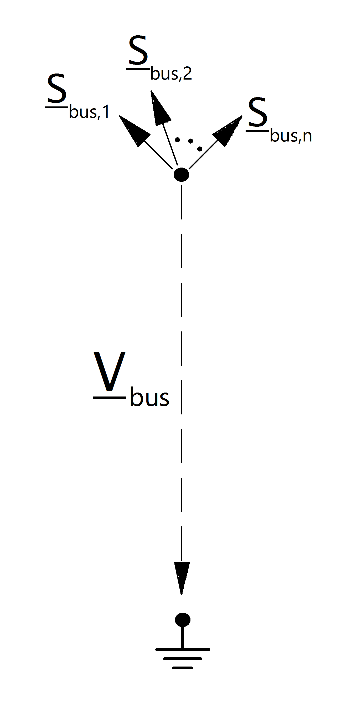

===========================
Шина, узел, кабельная муфта
===========================

.. seealso::
    :ref:`Unit Systems and Conventions <conventions>`

Параметры
=========================

*net.bus*

.. tabularcolumns:: |p{0.12\linewidth}|p{0.10\linewidth}|p{0.25\linewidth}|p{0.30\linewidth}|
.. csv-table:: 
   :file: bus_par.csv
   :delim: ;
   :widths: 10, 10, 25, 40

.. |br| raw:: html

    
   
\*необходимо для выполнения расчета потока мощности |br| \*\*необходимо для расчёта оптимального потока мощности

.. note:: Пределы напряжения для шин не могут быть установлены для резервных шин и будут игнорироваться при расчёте оптимального потока мощности.

   
Электрическая модель
====================

    

Результирующие параметры
=========================

*net.res_bus*

.. tabularcolumns:: |p{0.10\linewidth}|p{0.10\linewidth}|p{0.40\linewidth}|
.. csv-table:: 
   :file: bus_res.csv
   :delim: ;
   :widths: 10, 10, 40
    
Расчёт потоков мощности осуществляется по следующим формулам:

.. math::
   :nowrap:
   
   \begin{align*}
    vm\_pu &= \lvert \underline{V}_{bus} \rvert \\
    va\_degree &= \angle \underline{V}_{bus} \\
    p\_mw &= Re(\sum_{n=1}^N  \underline{S}_{bus, n}) \\
    q\_mvar &= Im(\sum_{n=1}^N  \underline{S}_{bus, n}) 
   \end{align*}

.. note::

   За положительное направление мощности принято направление "к шине". Например, шина с положительным значением мощности потребляет, а шина с отрицательным значением мощности - отдаёт мощность.