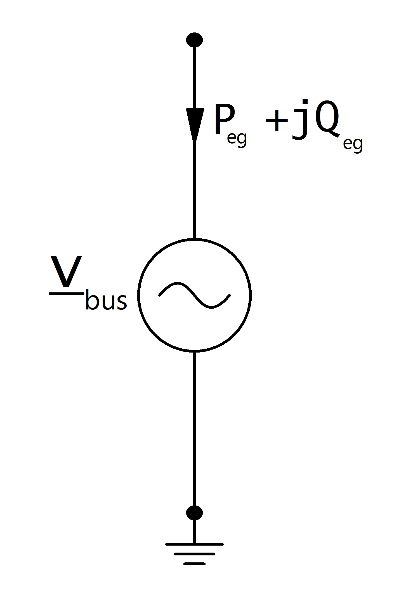

=============
Внешняя сеть
=============

.. note::

   Внешняя сеть ведёт себя аналогично генератору. Положительное значение мощности означает выдачу от внешней сети в текущую сеть, а отрицательное занечение мощности означает потребление её внешней сетью

.. seealso::
    :ref:`Система единиц и условные обозначения <conventions>`
   
Входные параметры
=============================

*net.ext_grid*

.. tabularcolumns:: |p{0.15\linewidth}|p{0.10\linewidth}|p{0.15\linewidth}|p{0.40\linewidth}|
.. csv-table:: 
   :file: ext_grid_par.csv
   :delim: ;
   :widths: 15, 10, 15, 40

.. |br| raw:: html

    
   
\*используется для расчёта установившегося потока мощности |br| \*\*используется для расчёта оптимальных потоков мощности |br| \*\*\*используется для расчёта токов короткого замыкания
   
Электрическая модель
====================

Внешняя сеть моделируется как источник напряжения и ведёт себя как узел резервирования мощности:

with:
    
.. math::
   :nowrap:
   
   \begin{align*}
    \underline{v}_{bus} &= vm\_pu \cdot e^{j \cdot \theta} \\
   \theta &= shift\_degree \cdot \frac{\pi}{180}
   \end{align*}

Результирующие параметры
==========================    
*net.res_ext_grid*

.. tabularcolumns:: |p{0.10\linewidth}|p{0.1\linewidth}|p{0.50\linewidth}|
.. csv-table:: 
   :file: ext_grid_res.csv
   :delim: ;
   :widths: 10, 10, 50

Выдача или потребление активной и реактивной мощности в узле резервирования мощности является результатом расчёта перетока мощности:
   
.. math::
   :nowrap:
   
   \begin{align*}
    p\_mw &= P_{eg} \\
    q\_mvar &= Q_{eg}
    \end{align*}