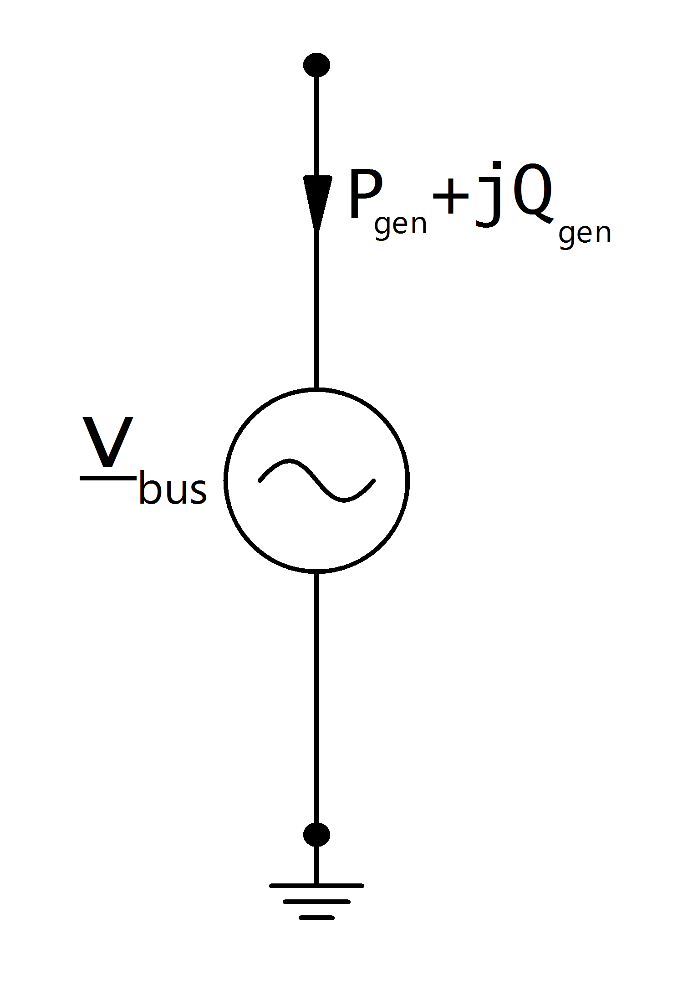

.. _gen:

=============
Генератор
=============

.. note::
    Генератор с положительной активной мощностью представляет собой генератор, управляемый напряжением. Если вы хотите смоделировать постоянную генерацию без контроля напряжения, используйте элемент Static Generator.

.. seealso::
    :ref:`Система единиц и условные обозначения <conventions>`

    
Входные параметры
=====================

*net.gen*

.. tabularcolumns:: |p{0.10\linewidth}|p{0.1\linewidth}|p{0.25\linewidth}|p{0.4\linewidth}|
.. csv-table:: 
   :file: gen_par.csv
   :delim: ;
   :widths: 10, 10, 25, 40

.. |br| raw:: html

    
   
\*требуется для расчёта потоков мощности |br| \*\*параметы для расчёта оптимальных потоков мощности (в программе не реализовано) |br| \*\*\*требуется для расчёта токов короткого замыкания

   
Электрическая модель
====================

Generators are modelled as PV-nodes in the power flow:

Величина напряжения и активная мощность определяются входными параметрами в таблице генератора:

.. math::
   :nowrap:
   
   \begin{align*}
    P_{gen} &= p\_mw * scaling \\
    v_{bus} &= vm\_pu
   \end{align*}
    
Результирующие параметры
==========================
*net.res_gen*

.. tabularcolumns:: |p{0.10\linewidth}|p{0.10\linewidth}|p{0.50\linewidth}|
.. csv-table:: 
   :file: gen_res.csv
   :delim: ;
   :widths: 10, 10, 50

Расчёт потоков мощности возвращает реактивную мощность генератора и угол напряжения:

.. math::
   :nowrap:

   \begin{align*}
    p\_mw &= P_{gen} \\
    q\_mvar &= Q_{gen} \\
    va\_degree &= \angle \underline{v}_{bus} \\
    vm\_degree &= |\underline{v}_{bus}|
   \end{align*}

   
.. note::
     Если поток мощности рассчитывается с опцией enforce_qlims, а реактивная мощность генератора превышает или находится ниже максимального или минимального предела реактивной мощности,
     то генератор преобразуется в статический генератор с максимальной / минимальной реактивной мощностью как постоянная реактивная генерация энергии.
     Напряжение на шине генератора больше не равно установленной в параметрах.    