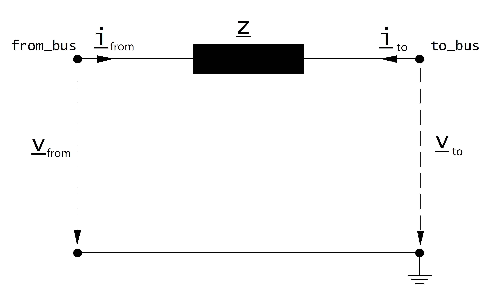

==========================
Токоограничивающий реактор
==========================

.. seealso::
    :ref:`Система единиц и условные обозначения <conventions>`

Входные параметры
=====================

*net.impedance*

.. tabularcolumns:: |p{0.10\linewidth}|p{0.10\linewidth}|p{0.15\linewidth}|p{0.4\linewidth}|
.. csv-table:: 
   :file: impedance_par.csv
   :delim: ;
   :widths: 10, 10, 15, 40

\*необходимы для расчёта потоков мощности.

.. _impedance_model:

Электрическая модель
====================

Токоограничивающий реактор моделируется как продольное сопротивление с :math:`\underline{z}_{ft} \neq \underline{z}_{tf}` :

Значения в относительных единицах, указанные в таблице входных параметров, принимаются относительно номинального напряжения на входной и выходной шине, а также полной мощности, указанной в таблице входных параметров.
Таким образом, значения в относительных единицах преобразуются в именованные единицы:

.. math::
   :nowrap:

   \begin{align*}
    \underline{z}_{ft} &= (rft\_pu + j \cdot xft\_pu) \cdot \frac{S_{N}}{sn\_mva} \\
    \underline{z}_{tf} &= (rft\_pu + j \cdot xtf\_pu) \cdot \frac{S_{N}}{sn\_mva} \\
    \end{align*}

где :math:`S_{N}` это базисная мощность в системе относительных единиц (see :ref:`Система единиц и условные обозначения<conventions>`). 

Асимметричное сопротивление приводит к асимметричной матрице проводимостей узловых точек:

.. math::
   :nowrap:
   
    \begin{bmatrix} Y_{00} & \dots & \dots  & Y_{nn} \\
    \vdots & \ddots & \underline{y}_{ft} & \vdots \\
    \vdots &  \underline{y}_{tf} & \ddots & \vdots \\
    \underline{Y}_{n0} & \dots & \dots & \underline{y}_{nn}\\
    \end{bmatrix}

Результирующие параметры
==========================
*net.res_impedance*

.. tabularcolumns:: |p{0.10\linewidth}|p{0.1\linewidth}|p{0.55\linewidth}|
.. csv-table:: 
   :file: impedance_res.csv
   :delim: ;
   :widths: 10, 10, 55

.. math::
   :nowrap:
   
   \begin{align*}
    i\_from\_ka &= i_{from}\\
    i\_to\_ka &= i_{to}\\
    p\_from\_mw &= Re(\underline{v}_{from} \cdot \underline{i}^*_{from}) \\    
    q\_from\_mvar &= Im(\underline{v}_{from} \cdot \underline{i}^*_{from}) \\
    p\_to\_mw &= Re(\underline{v}_{to} \cdot \underline{i}^*_{to}) \\
    q\_to\_mvar &= Im(\underline{v}_{to} \cdot \underline{i}^*_{to}) \\
	pl\_mw &= p\_from\_mw + p\_to\_mw \\
	ql\_mvar &= q\_from\_mvar + q\_to\_mvar \\
    \end{align*}