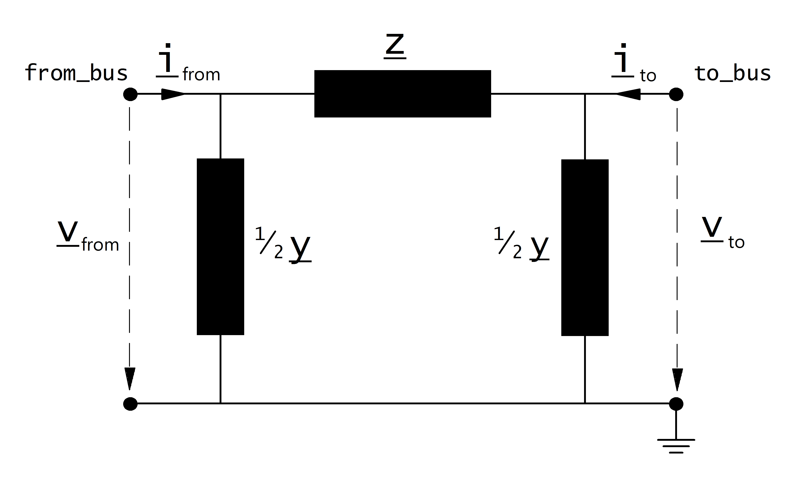

=============
Линия
=============

.. |br| raw:: html

     
    
.. seealso::

    :ref:`Система единиц и условные обозначения <conventions>` |br|
    :ref:`Библиотека стандартных типов <std_types>`
    
Входные параметры
=============================

*net.line*

.. tabularcolumns:: |p{0.15\linewidth}|p{0.10\linewidth}|p{0.25\linewidth}|p{0.40\linewidth}|
.. csv-table:: 
   :file: line_par.csv
   :delim: ;
   :widths: 15, 10, 25, 40
  
\*необходимо для расчёта потоков мощности в установившемся режиме |br| \*\*параметры для расчёта оптимальных потоков мощноси |br| \*\*\*параметры для расчёта токов короткого замыкания

.. note::

    Задание нулевой длины для линий электропередач приведёт к делению на ноль при расчёте потоков мощности и это не допускается. Линии с очень малым сопротивлением могут привести к проблемам сходимости при расчёте потоков мощности
    по той же причине. Если вы хотите накоротко соединить две шины, используйте выключатель вместо линии с малым сопротивлением!

Электрическая модель
====================

Линия моделируется :math:`\pi`-образной схемой замещения:

                   ..
    
Параметры элементов схемы замещения рассчитывается на основе входных параметров по следующим формулам:

.. math::
   :nowrap:

   \begin{align*}
    \underline{Z} &= (r\_ohm\_per\_km + j \cdot x\_ohm\_per\_km) \cdot \frac{length\_km}{parallel}  \\
    \underline{Y}&= (g\_us\_per\_km \cdot 1 \cdot 10^-6 + j \cdot 2 \pi f \cdot c\_nf\_per\_km \cdot 1 \cdot 10^-9) \cdot length\_km \cdot parallel
   \end{align*}
    
Частота электрического тока :math:`f` задаётся при создании электрической сети. Значение по умолчанию :math:`f = 50 Hz`.

Параметры затем преобразуются в относительные единицы:

.. math::
   :nowrap:

   \begin{align*}
    Z_{N} &= \frac{V_{N}^2}{S_{N}} \\
    \underline{z} &= \frac{\underline{Z}}{Z_{N}} \\
    \underline{y} &= \underline{Y} \cdot Z_{N} \\
    \end{align*}

где опорное напряжение :math:`V_{N}`является номинальным напряжением входной шины, номинальная полная мощность :math:`S_{N}` определена в системы единиц сети (see :ref:`Система единиц и условные обозначения<conventions>`).

.. note::
    предполагается, что номинальные напряжения шин соединяемых линией равны, что означает, что программа не поддерживает линии, которые соединяют разные уровни напряжения.
    Если вы хотите соединить разные уровни напряжения то используйте трансформатор либо элемент сопротивления (токоограничивающий реактор).
    
Результирующие параметры
==========================
   
*net.res_line*

.. tabularcolumns:: |p{0.15\linewidth}|p{0.10\linewidth}|p{0.55\linewidth}|
.. csv-table:: 
   :file: line_res.csv
   :delim: ;
   :widths: 15, 10, 55
   
Результат расчёта потоков мощности определяется по следующим формулам:

.. math::
   :nowrap:
   
   \begin{align*}
    p\_from\_mw &= Re(\underline{v}_{from} \cdot \underline{i}^*_{from}) \\    
    q\_from\_mvar &= Im(\underline{v}_{from} \cdot \underline{i}^*_{from}) \\
    p\_to\_mw &= Re(\underline{v}_{to} \cdot \underline{i}^*_{to}) \\
    q\_to\_mvar &= Im(\underline{v}_{to} \cdot \underline{i}^*_{to}) \\
	pl\_mw &= p\_from\_mw + p\_to\_mw \\
	ql\_mvar &= q\_from\_mvar + q\_to\_mvar \\
    i\_from\_ka &= i_{from} \\
    i\_to\_ka &= i_{to} \\
    i\_ka &= max(i_{from}, i_{to}) \\
    loading\_percent &= \frac{i\_ka}{imax\_ka \cdot df \cdot parallel} \cdot 100 
    \end{align*}