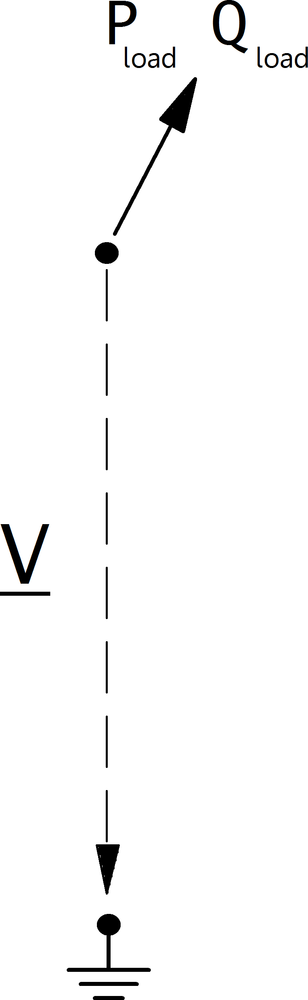

=============
Нагрузка
=============

.. note::

   Нагрузка всегда имеет положительную потребляемую активную мощность.

.. seealso::
    :ref:`Система единиц и условные обозначения <conventions>`

Входные параметры
=====================

*net.load*

.. tabularcolumns:: |p{0.10\linewidth}|p{0.10\linewidth}|p{0.25\linewidth}|p{0.40\linewidth}|

.. csv-table::
   :file: load_par.csv
   :delim: ;
   :widths: 10, 10, 25, 40

\*требуется для расчёта потоков мощности.

.. note::
    
    Значение полной мощности sn_mva задаётся в качестве дополнительной информации для использования в контроллерах. Этот параметр не учитывается в расчёте потока мощности! 

Электрическая модель
====================

Нагрузки моделируются как шины PQ при расчете потока мощности с возможностью использования так называемой модели нагрузки ZIP, где нагрузка представлена ​​как комбинация постоянной мощности (P), постоянного тока (I) и постоянного сопротивления (Z):

Какая часть нагрузки считается постоянной при постоянной мощности, постоянном токе или постоянном сопротивлении, определяется следующим образом:
  
.. math::
   :nowrap:
   
    \begin{align*}
    z_{const} =& const\_z\_percent / 100 \\
    i_{const} =& const\_i\_percent / 100 \\
    p_{const} =& (100 - const\_z\_percent - const\_i\_percent) / 100
    \end{align*}
    
Мощность нагрузки определяется по следующим формулам:

.. math::
   :nowrap:
   
   \begin{align*}
    P_{load} =&  p\_mw \cdot scaling \cdot (p_{const} + z_{const} \cdot V^2 + i_{const} \cdot V ) \\
    Q_{load} =&  q\_mvar \cdot scaling \cdot (p_{const} + z_{const} \cdot V^2 + i_{const} \cdot V)
    \end{align*}

Результирующие параметры
==========================    
*net.res_load*

.. tabularcolumns:: |p{0.10\linewidth}|p{0.10\linewidth}|p{0.45\linewidth}|
.. csv-table:: 
   :file: load_res.csv
   :delim: ;
   :widths: 10, 10, 45
   
Значения мощностей в результирующей таблице net.res_load эквивалентны :math:`P_{load}` and :math:`Q_{load}`.

