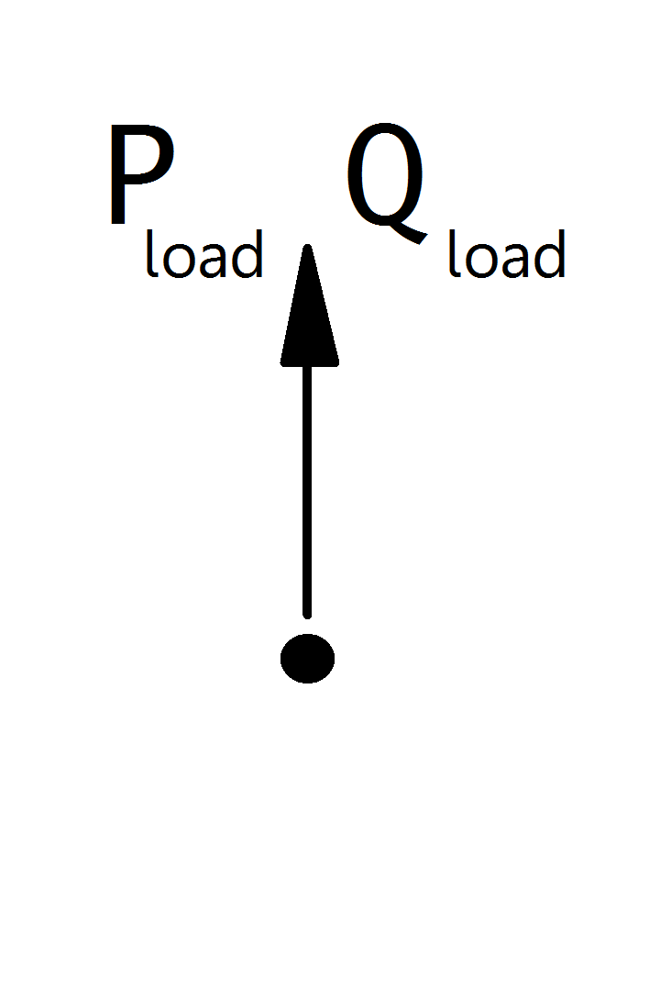

==================
Генератор ВИЭ, КГУ
==================

.. note::

   Статические генераторы всегда должны иметь положительное значение активной мощности. Если вы хотите смоделировать постоянное энергопотребление, рекомендуется использовать элемент Нагрузка вместо статического генератора с отрицательным значением активной мощности.
   Если вы хотите смоделировать генератор, управляемый напряжением, используйте неоэлемент Генератор.

.. seealso::
    :ref:`Система единиц и условные обозначения <conventions>`

Входные параметры
=====================

*net.sgen*

.. tabularcolumns:: |p{0.10\linewidth}|p{0.10\linewidth}|p{0.25\linewidth}|p{0.40\linewidth}|
.. csv-table:: 
   :file: sgen_par.csv
   :delim: ;
   :widths: 10, 10, 25, 40

.. |br| raw:: html

    
   
\*Необходимо для расчёта потоков мощности |br| \*\*параметр расчёта оптимальных потоков мощности

   
Электрическая модель
====================

Статические генераторы моделируются как шины PQ при расчете потоков мощности:

    
Значения P и Q рассчитываются на основании таблицы входных параметров:

.. math::
   :nowrap:
   
   \begin{align*}
    P_{sgen} &= p\_mw \cdot scaling \\
    Q_{sgen} &= q\_mvar \cdot scaling \\
    \end{align*}

.. note::
    
    Значение полной мощности sn_mva предоставляется в качестве дополнительной информации для использования в контроллере или других функциях. При расчёте потоков мощности оно не учитывается!

Результирующие параметры
==========================
*net.res_sgen*

.. tabularcolumns:: |p{0.10\linewidth}|p{0.10\linewidth}|p{0.50\linewidth}|
.. csv-table:: 
   :file: sgen_res.csv
   :delim: ;
   :widths: 10, 10, 50

Значения мощностей в результате расчёта эквивалентны :math:`P_{sgen}` и :math:`Q_{sgen}`.