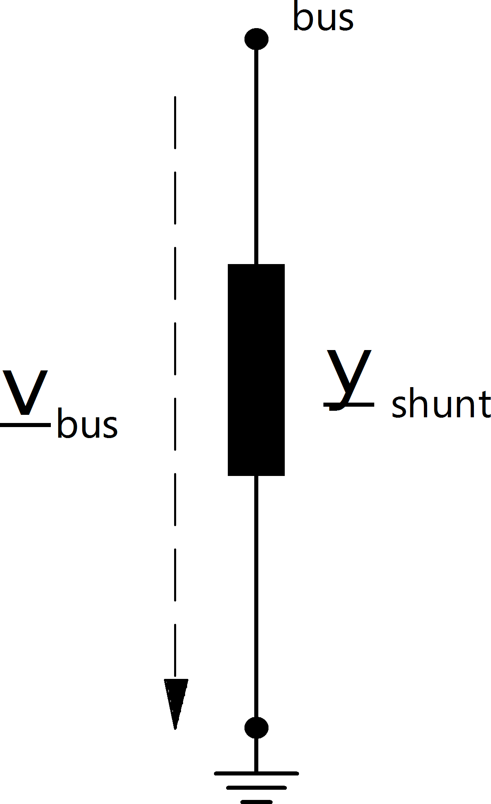

.. _shunt:

=========================
Дугогасящий реактор (ДГК)
=========================

.. seealso::
    :ref:`Система единиц и условные обозначения <conventions>`

Входные параметры
=====================

*net.shunt*

.. tabularcolumns:: |p{0.10\linewidth}|p{0.10\linewidth}|p{0.25\linewidth}|p{0.4\linewidth}|
.. csv-table:: 
   :file: shunt_par.csv
   :delim: ;
   :widths: 10, 10, 25, 40

\*необходимо для расчёта потоков мощности.

   
Электрическая модель
====================

Значение поомощности определяются при :math:`v = 1` о.е. и умножаются на "Умножитель мощности":
   
.. math::
   :nowrap:
   
   \begin{align*}
   \underline{S}_{shunt, ref} &= (p\_mw + j \cdot q\_mvar) \cdot step
   \end{align*}
   
Поскольку :math:`\underline{S}_{shunt, ref}` это полная мощность при номинальном напряжении то:

.. math::
   :nowrap:
   
   \begin{align*}
   \underline{Y}_{shunt} = \frac{\underline{S}_{shunt, ref}}{vn\_kv^2}
   \end{align*}
   
Ковертирование в систему относительных единиц даст следующий результат:

.. math::
   :nowrap:
   
   \begin{align*}
   \underline{y}_{shunt} &= \frac{\underline{S}_{shunt, ref}}{V_{N}^2} \cdot Z_{N}\\
                         &= \frac{\underline{S}_{shunt, ref}}{V_{N}^2} \cdot \frac{V_{N}^2}{S_{N}} \\
                         &= \frac{S_{shunt, ref}}{S_{N}}
   \end{align*}

с базисными значениями, которые определены в :ref:`Система единиц и условные обозначения<conventions>`.
   
Результирующие параметры
==========================
*net.res_shunt*

.. tabularcolumns:: |p{0.10\linewidth}|p{0.10\linewidth}|p{0.40\linewidth}|
.. csv-table:: 
   :file: shunt_res.csv
   :delim: ;
   :widths: 10, 10, 40

.. math::
   :nowrap:
   
   \begin{align*}
    p\_mw &= Re(\underline{v}_{bus} \cdot \underline{i}_{shunt}) \\    
    q\_mvar &= Im(\underline{v}_{bus} \cdot \underline{i}_{shunt}) \\    
    vm\_pu &= v_{bus}
    \end{align*}