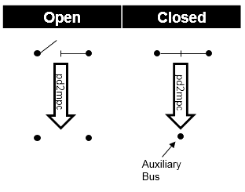
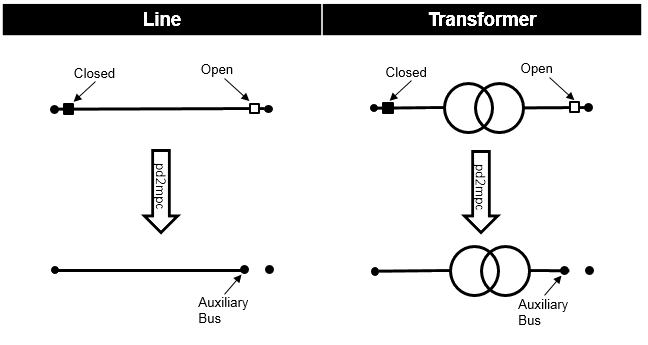

.. _switch_model:

==========================
Выключатель, разъединитель
==========================

Входные параметры
=====================

*net.switch*

.. tabularcolumns:: |p{0.10\linewidth}|p{0.10\linewidth}|p{0.25\linewidth}|p{0.40\linewidth}|
.. csv-table:: 
   :file: switch_par.csv
   :delim: ;
   :widths: 10, 10, 25, 40

\*необходимо для расчёта потоков мощности.

   
Электрическая модель
====================

*Выключатели между шинами:*

Две шины, соединённые включенным выключателем или разъединителем моделируются как одна единая шина. Отключенные выключатели или разъединители игнорируются при расчёте потоков мощности и токов короткого замыкания:

Это дает следующие преимущества по сравнению с моделированием переключателя элементом с малым сопротивлением:

    - нет падения напряжения на переключателе (идеальный переключатель)
    - нет проблем сходимости из-за малого/большого сопротивления
    - меньше узлов в расчётной матрице
    
*Выключатели между шинами и элементами сети:*

При расчёте потоков мощности для каждого отключенного коммутационного аппарата между элементом схемы и шиной создается вспомогательная шина. Затем к этой шине подключается ветвь, соответствующая элементу. Это дает следующие преимущества по сравнению с моделированием коммутационных аппаратов путем вывода элемента из работы:

    - расчитивыется зарядный ток линии или токи холостого хода трансформатора
    - сохраняется информация о положении коммутационного аппарата
    - может быть смоделирована неисправность на элементе с отключенными некоторыми коммутационными аппаратами (например повреждение на линии отключенной с одной стороны)

Включенные коммутационные аппараты в цепи элементов сети игнорируются:

