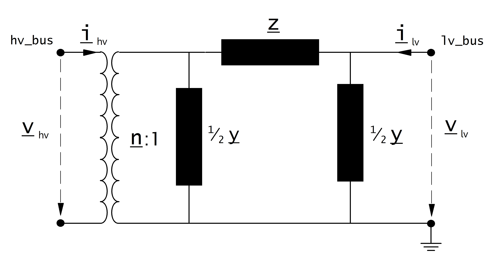

.. _trafo:

============================
Трансформатор двухобмоточный
============================

.. |br| raw:: html

     
    
.. seealso::

    :ref:`Система единиц и условные обозначения <conventions>` |br|
    :ref:`Библиотека стандартных типов <std_types>`

Входные параметры
=====================

*net.trafo*

.. tabularcolumns:: |p{0.15\linewidth}|p{0.1\linewidth}|p{0.25\linewidth}|p{0.4\linewidth}|
.. csv-table:: 
   :file: trafo_par.csv
   :delim: ;
   :widths: 15, 10, 25, 40
  
\*требуется для расчёта потоков мощности |br| \*\*параметр для расчёта оптимальных потоков мощности

.. note:: Ограничение нагрузки трансформатора рассчитывается с опцией trafo_loading = "current" для оптимальных потоков мощности:

   
Электрическая модель
====================

.. _modtrafo:

Эквивалентная схема, используемая для моделирования трансформатора, может быть выбрана при​расчёте потоков мощности с помощью параметра «Модель схемы замещения трансформатора».
   
*trafo_model='t':*

*trafo_model='pi':*

    
Коэффициент трансформации
-------------------------

Коэффициент трансформации определяется как:

.. math::
   :nowrap:
   
   \begin{align*}
   n &= \frac{V_{ref, HV, transformer}}{V_{ref, LV, transformer}} \cdot \frac{V_{ref, LV bus}}{V_{ref, HV bus}}
   \end{align*}

Напряжения шин высокого и низкого напряжения взяты из элементов шина(узел) к которым подключён трансформатор. Напряжения трансформатора берется непосредственно из параметров трансформатора:

.. math::
   :nowrap:
   
   \begin{align*}
    V_{ref, HV, transformer} &= vn\_hv\_kv \\
    V_{ref, LV, transformer} &= vn\_lv\_kv
   \end{align*}
   

Если расчёт потоков мощности выполняется с опцией "Учитывать углы при расчёте мощности"=Да то комплексный коэффициент трансформации задается как:

.. math::
   :nowrap:
   
   \begin{align*}
   \underline{n} &= n \cdot e^{j \cdot \theta \cdot \frac{\pi}{180}} \\
   \theta &= shift\_degree 
   \end{align*}
   
В противном случае коэффициент трансформации не содержит фазовый сдвиг:

.. math::
   :nowrap:
   
   \begin{align*}
   \underline{n} &= n
   \end{align*}
   
Значения сопротивлений
----------------------

Сопротивление току короткого замыканий рассчитывается как:

.. math::
   :nowrap:

   \begin{align*}
   z_k &= \frac{vk\_percent}{100} \cdot \frac{1000}{sn\_mva} \\
   r_k &= \frac{vkr\_percent}{100} \cdot \frac{1000}{sn\_mva} \\
   x_k &= \sqrt{z^2 - r^2} \\
   \underline{z}_k &= r_k + j \cdot x_k
   \end{align*}    

Проводимость намагничивания рассчитывается как:

.. math::
   :nowrap:

   \begin{align*}
   y_m &= \frac{i0\_percent}{100} \\
   g_m &= \frac{pfe\_mw}{sn\_mva \cdot 1000} \cdot \frac{1000}{sn\_mva} \\
   b_m &= \sqrt{y_m^2 - g_m^2} \\
   \underline{y_m} &= g_m - j \cdot b_m
   \end{align*}    

Рассчитанные таким образом величины относятся к именованным значениям трансформатора. Чтобы преобразовать их в систему отноительных единиц необходимо использовать базисные значения:

.. math::
   :nowrap:

   \begin{align*}
    Z_{N} &= \frac{V_{N}^2}{S_{N}} \\
    Z_{ref, trafo} &= \frac{vn\_lv\_kv^2 \cdot 1000}{sn\_mva} \\
    \underline{z} &= \underline{z}_k \cdot \frac{Z_{ref, trafo}}{Z_{N}} \\
    \underline{y} &= \underline{y}_m \cdot \frac{Z_{N}}{Z_{ref, trafo}} \\
    \end{align*}

Где базисное напряжение :math:`V_{N}` это номинальное напряжение на стороне низкого напряжения трансформатора а номинальная полная мощность :math:`S_{N}` задана в описании (see :ref:`Система единиц и условные обозначения<conventions>`). 

Регулятор напряения
-------------------

**Линейный регулятор**
Линейный регулятор моделируется установкой параметра tap_phase_shifter в состояние False и заданием шага изменения напряжения РПН (Шаг РПН, %).

Номинальное напряжение затем умножается на коэффициент положения регулятора напряжения:

.. math::
   :nowrap:
   
   \begin{align*}
    n_{tap} = 1 + (tap\_pos - tap\_neutral) \cdot \frac{tap\_st\_percent}{100}
    \end{align*}
    
Напряжения трансформаторов пересчитываются в зависимости от места установки регулятора напряжения (параметр "РПН на стороне ВН" или "РПН на стороне НН") по следующим формулам:

.. tabularcolumns:: |p{0.2\linewidth}|p{0.15\linewidth}|p{0.15\linewidth}|
.. csv-table:: 
   :file: trafo_tap.csv
   :delim: ;
   :widths: 20, 15, 15

.. note::
    Параметры "максимальное положение РПН" и "Минимальное положение РПН" не учитываются в расчёте потоков мощности. Пользователь несет ответственность за то, чтобы положение РПН находилось в указанных пределах!

**Поперечный регулятор**

В дополнение к параметру "Шаг РПН, %" может быть задано значение для параметра tap_step_degree для моделирования углового сдвига для каждого ответвления, что приводит к поперечному регулированию, который влияет как на величину так и на угол коэффициента трансформации трансформатора.

**Идеальный фазорегулятор**

Если параметр tap_phase_shifter установлен в True, переключатель ответвлений (РПН) моделирует работу идеального фазорегулятора, 
то есть при каждом переключении ответвления изменяется фаза на постоянную величину шага.

.. math::
   :nowrap:
   
   \begin{align*}
   \underline{n} &= n \cdot e^{j \cdot (\theta + \theta_{tp}) \cdot \frac{\pi}{180}} \\
   \theta &= shift\_degree 
   \end{align*}
   
Величина шага изменения фазы напряжения задаётся  параметромn tap_step_degree. В таком случае:

.. math::
   :nowrap:
   
   \begin{align*}
   \theta_{tp} = tap\_st\_degree \cdot (tap\_pos - tap\_neutral)
   \end{align*}

или он может быть задан постоянным шагом изменения напряжения (параметр "Шаг РПН, %"), и в этом случае угол рассчитывается как:

.. math::
   :nowrap:
   
   \begin{align*}
   \theta_{tp} = 2 \cdot arcsin(\frac{1}{2} \cdot \frac{tap\_st\_percent}{100})  \cdot (tap\_pos - tap\_neutral)
   \end{align*}

Если для идеального фазорегулятора заданы оба значения то расчёт потоков мощности вызовет ошибку.

.. seealso::

    `ENTSO-E - Phase Shift Transformers Modelling, Version 1.0.0, May 2015 <https://docstore.entsoe.eu/Documents/CIM_documents/Grid_Model_CIM/ENTSOE_CGMES_v2.4_28May2014_PSTmodelling.pdf>`_
    
    `J. Verboomen, D. Van Hertem, P. H. Schavemaker, W. L. Kling and R. Belmans, "Phase shifting transformers: principles and applications," 2005 International Conference on Future Power Systems, Amsterdam, 2005 <https://ieeexplore.ieee.org/document/1600575/>`_

Результирующие параметры
==========================
*net.res_trafo*

.. tabularcolumns:: |p{0.15\linewidth}|p{0.10\linewidth}|p{0.55\linewidth}|
.. csv-table:: 
   :file: trafo_res.csv
   :delim: ;
   :widths: 15, 10, 55

.. math::
   :nowrap:
   
   \begin{align*}
    p\_hv\_mw &= Re(\underline{v}_{hv} \cdot \underline{i}^*_{hv}) \\    
    q\_hv\_mvar &= Im(\underline{v}_{hv} \cdot \underline{i}^*_{hv}) \\
    p\_lv\_mw &= Re(\underline{v}_{lv} \cdot \underline{i}^*_{lv}) \\
    q\_lv\_mvar &= Im(\underline{v}_{lv} \cdot \underline{i}^*_{lv}) \\
	pl\_mw &= p\_hv\_mw + p\_lv\_mw \\
	ql\_mvar &= q\_hv\_mvar + q\_lv\_mvar \\
    i\_hv\_ka &= i_{hv} \\
    i\_lv\_ka &= i_{lv}
    \end{align*}

.. _loadtrafo:    

Определение нагрузки трансформатора зависит от параметра "Режим расчёта нагрузки трансформатора" в диалоге настоек расчёта потоков мощности установившегося режима.

Для режима "Как отношение тока к номинальному току трансформатора" нагрузка рассчитывается:

.. math::
   :nowrap:
   
   \begin{align*}  
    loading\_percent &= max(\frac{i_{hv} \cdot vn\_hv\_kv}{sn\_mva}, \frac{i_{lv} \cdot vn\_lv\_kv}{sn\_mva})  \cdot 100
   \end{align*}
    
Для режима "Как отношение полной мощности к номинальной мощности трансформатора" нагрузка рассчитывается:
    
.. math::
   :nowrap:
   
   \begin{align*}  
    loading\_percent &= max( \frac{i_{hv} \cdot v_{hv}}{sn\_mva}, \frac{i_{lv} \cdot v_{lv}}{sn\_mva}) \cdot 100
    \end{align*} 
