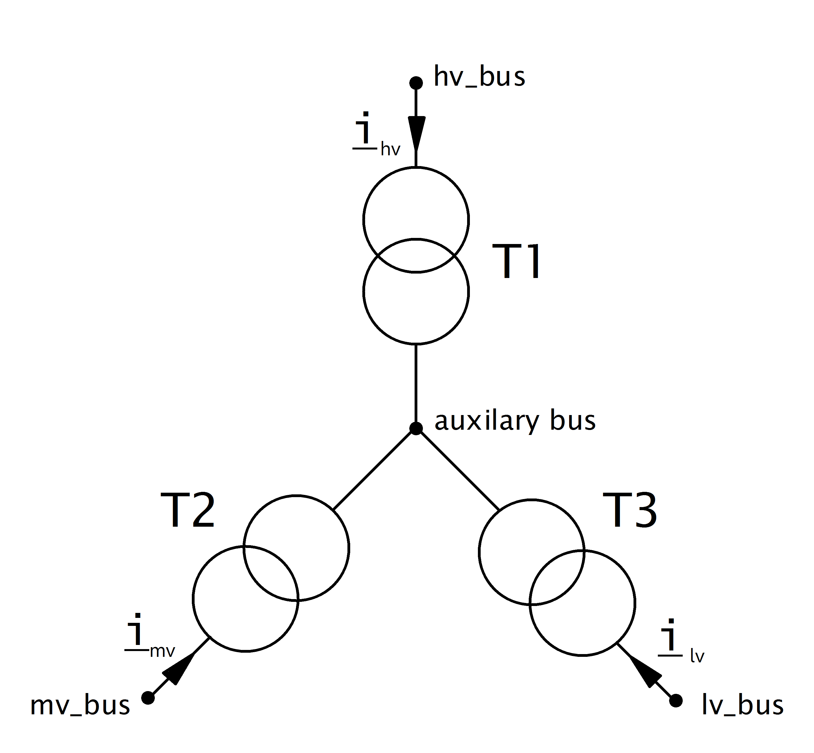

============================
Трансформатор трёхобмоточный
============================

.. |br| raw:: html

     
    
.. seealso::

    :ref:`Система единиц и условные обозначения <conventions>` |br|
    :ref:`Библиотека стандартных типов <std_types>`

.. note::
    Все напряжения короткого замыкания даны относительно максимального потока полной мощности.
    Например, "Напряжение КЗ ВС,%" - это напряжение короткого замыкания от высокого до
    среднего напряжения. Оно дается относительно минимума номинальной полной 
    мощности на высоком и среднем уровне: min(Номинальная мощность ВН, Номинальная мощность СН).
    Это соответствует подходу большинства коммерческих программ расчета сети (например, PowerFactory).
    Однако некоторые инструменты (например PSS Sincal) определяют все напряжения короткого замыкания относительно
    к общей номинальной полной мощности трансформатора: max(Номинальная мощность ВН, Номинальная мощность СН, Номинальная мощность НН). 
    Возможно, вам придется преобразовать значения в зависимости от того, как определены напряжения короткого замыкания.

Входные параметры
=========================

*net.trafo3w*

.. tabularcolumns:: |p{0.15\linewidth}|p{0.1\linewidth}|p{0.25\linewidth}|p{0.4\linewidth}|
.. csv-table:: 
   :file: trafo3w_par.csv
   :delim: ;
   :widths: 15, 10, 10, 30

\*необходимо для расчёта потоков мощности установившегося режима.

.. note:: Нагрузка трехобмоточного трансформатора еще не может быть ограничена оптимальным потоком мощности.

.. _trafo3w_model:

Электрическая модель
====================

Трёхобмоточный трансформатор моделируется тремя двухобмоточными соединёнными в :math:`Y`:

Параметры этих трёх трансформаторов определяются ниже:

.. tabularcolumns:: |p{0.15\linewidth}|p{0.15\linewidth}|p{0.15\linewidth}|p{0.15\linewidth}|
.. csv-table:: 
   :file: trafo3w_conversion.csv
   :delim: ;
   :widths: 10, 15, 15, 15

.. _losses:

Потери в стали (pfe\_kw) и потери холостого хода (i0\_percent) трёхобмоточного трансформатора становятся параметрами T1 ('hv').
Параметр "Где учитывать потери трансформатора" в диалоге запуска расчёта потоков мощности однако также позволяет назначить потери трансформаторам T2 ('Средняя сторона'), T3('Низкая сторона') или всей звезде трансформаторов ('Звезда').
   
Для расчёта напряжений короткого замыкания :math:`v_{k, t1..t3}` и :math:`v_{r, t1..t3}`, сначала все напряжения конвертируются из межобмоточных
в напряжения отдельных ветвей схемы замещения

.. math::
   :nowrap:

   \begin{align*}
    v'_{k, hm} &= vk\_hv\_percent \cdot \frac{sn\_hv\_mva}{min(sn\_hv\_mva, sn\_mv\_mva)} \\
    v'_{k, ml} &= vk\_mv\_percent \cdot \frac{sn\_hv\_mva}{min(sn\_mv\_mva, sn\_lv\_mva)} \\
    v'_{k, lh} &= vk\_lv\_percent \cdot \frac{sn\_hv\_mva}{min(sn\_hv\_mva, sn\_lv\_mva)}
    \end{align*}   
    
Этит трансформаторы теперь представлены :math:`\Delta` -соединением эквивалентных трансформаторов. Поэтому для получения :math:`Y`-соединения требуется :math:`\Delta-Y`-преобразование:

.. math::
   :nowrap:

   \begin{align*}
    v'_{k, T1} &= \frac{1}{2} (v'_{k, hm} + v'_{k, lh} - v'_{k, ml}) \\
    v'_{k, T2} &= \frac{1}{2} (v'_{k, ml} + v'_{k, hm} - v'_{k, lh}) \\
    v'_{k, T3} &= \frac{1}{2} (v'_{k, ml} + v'_{k, lh} - v'_{k, hm})
    \end{align*}
    
Поскольку эти напряжения указаны относительно стороны высокого напряжения то они должны быть преобразованы обратно в уровень напряжения каждого трансформатора:

.. math::
   :nowrap:

   \begin{align*}
    v_{k, T1} &= v'_{k, t1} \\
    v_{k, T2} &= v'_{k, t2} \cdot \frac{sn\_mv\_mva}{sn\_hv\_mva} \\
    v_{k, T3} &= v'_{k, t3} \cdot \frac{sn\_lv\_mva}{sn\_hv\_mva}
    \end{align*}

Активная составляющая напряжения короткого замыкания рассчитывается аналогично.

Определение того, как рассчитываются сопротивления двухобмоточного трансформатора на основе этих параметров, можно найти :ref:`здесь<trafo>`.

.. note::
     Все напряжения короткого замыкания приведены относительно максимальной полной мощности.
     Например, "Напряжение КЗ ВС,%" - это напряжение короткого замыкания от высокой до
     средней обмотки. Оно задается относительно минимальной из полных мощностей
     обмоток высокого и среднего напряжения: min(Номинальная мощность ВН, Номинальная мощность СН). Это соответствует
     большинству коммерческих программ для расчётов электрических сетей (например PowerFactory).
     Некоторые программы (такие как PSS Sincal), однако определяют все напряжения короткого замыкания относительно
     обще номинальной полной мощности трансформатора:
     max (Номинальная мощность ВН, Номинальная мощность СН, Номинальная мощность НН). Возможно, вам придется преобразовать
     значения напряжений короткого замыкания в зависимости от того, как они определены.

Устройство РПН изменяет номинальное напряжение в схеме замещения двухобмоточного трансформатора:

.. tabularcolumns:: |p{0.2\linewidth}|p{0.15\linewidth}|p{0.15\linewidth}|p{0.15\linewidth}|
.. csv-table:: 
   :file: trafo3w_tap.csv
   :delim: ;
   :widths: 20, 15, 15, 15

с 

.. math::
   :nowrap:
   
   \begin{align*}
    n_{tap} = 1 + (tap\_pos - tap\_neutral) \cdot \frac{tap\_st\_percent}{100}
    \end{align*}

Параметры "РПН на стороне ВН(СН, НН)" определяют, находится ли устройство РПН в трансформаторе T1 («ВН»), T2 («СН») или T3 («НН»). Параметр "РПН в нейтрали обмотки" определяет, находится ли устройство РПН в нейтрали звезды обмотки трансформатора или на стороне выводов.
    
.. seealso::
    `MVA METHOD FOR 3-WINDING TRANSFORMER <https:/pangonilo.com/index.php?sdmon=files/MVA_Method_3-Winding_Transformer.pdf>`_

    

Результирующие параметры
==========================
**net.res_trafo3w**

.. tabularcolumns:: |p{0.15\linewidth}|p{0.1\linewidth}|p{0.60\linewidth}|
.. csv-table:: 
   :file: trafo3w_res.csv
   :delim: ;
   :widths: 15, 10, 60

.. math::
   :nowrap:
   
   \begin{align*}
    p\_hv\_mw &= Re(\underline{v}_{hv} \cdot \underline{i}_{hv}) \\    
    q\_hv\_mvar &= Im(\underline{v}_{hv} \cdot \underline{i}_{hv}) \\
    p\_mv\_mw &= Re(\underline{v}_{mv} \cdot \underline{i}_{mv}) \\    
    q\_mv\_mvar &= Im(\underline{v}_{mv} \cdot \underline{i}_{mv}) \\
    p\_lv\_mw &= Re(\underline{v}_{lv} \cdot \underline{i}_{lv}) \\
    q\_lv\_mvar &= Im(\underline{v}_{lv} \cdot \underline{i}_{lv}) \\
	pl\_mw &= p\_hv\_mw + p\_lv\_mw \\
	ql\_mvar &= q\_hv\_mvar + q\_lv\_mvar \\
    i\_hv\_ka &= i_{hv} \\
    i\_mv\_ka &= i_{mv} \\
    i\_lv\_ka &= i_{lv}
    \end{align*}
    
.. _load3wtrafo:

Определение нагрузки трансформатора зависит от параметра "Режим расчёта нагрузки трансформатора" в диалоге настоек расчёта потоков мощности установившегося режима.

Для режима "Как отношение тока к номинальному току трансформатора" нагрузка рассчитывается:

.. math::
   :nowrap:
   
   \begin{align*}  
    loading\_percent &= max(\frac{i_{hv} \cdot vn\_hv\_kv}{sn\_hv\_mva}, \frac{i_{mv} \cdot vn\_mv\_kv}{sn\_mv\_mva}, \frac{i_{lv} \cdot vn\_lv\_kv}{sn\_lv\_mva})  \cdot 100
   \end{align*}
    

Для режима "Как отношение полной мощности к номинальной мощности трансформатора" нагрузка рассчитывается:
    
.. math::
   :nowrap:
   
   \begin{align*}  
    loading\_percent &= max( \frac{i_{hv} \cdot v_{hv}}{sn\_hv\_mva}, \frac{i_{mv} \cdot v_{mv}}{sn\_mv\_mva}, \frac{i_{lv} \cdot v_{lv}}{sn\_lv\_mva}) \cdot 100
    \end{align*}