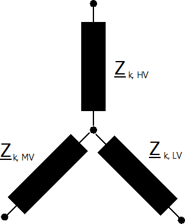

Элементы ветвей
=================

Ветви представляются единичным сопротивлением короткого замыкания:

    
Проводимости на землю не учитываются для всех ветвей.

Линия
-----------------------

.. math::
   :nowrap:

   \begin{align*}
    \underline{R}_k &= r\_ohm\_per\_km \cdot \frac{length\_km}{parallel} \cdot K_L\\
    \underline{X}_k &= x\_ohm\_per\_km \cdot \frac{length\_km}{parallel} 
   \end{align*}
   
где поправочный коэффициент для сопротивления короткого замыкания :math:`K_L` определяется как:

.. math::

  K_L=\left\{
  \begin{array}{@{}ll@{}}
            1 & \text{ for maximum short-circuit calculations} \\
            1 + 0.04 K^{-1} (endtemp\_degree - 20°C) & \text{ for minimum short-circuit calculations} 
  \end{array}\right.

Конечная температура в градусах после окончания короткого замыкания должна быть определена параметром endtemp\_degre в параметрах линии.

Двухобмоточный трансформатор
----------------------------

Сопротивление короткого замыкания рассчитываетя как:

.. math::
   :nowrap:

   \begin{align*}
   z_k &= \frac{vk\_percent}{100} \cdot \frac{1000}{sn\_kva} \cdot K_T \\
   r_k &= \frac{vkr\_percent}{100} \cdot \frac{1000}{sn\_kva} \cdot K_T \\
   x_k &= \sqrt{z^2 - r^2} \\
   \end{align*}    

где поправочный коэффициент :math:`K_T` определен в стандарте как:

.. math::

    K_{T} = 0.95 \frac{c_{max}}{1 + 0.6 x_T}

где :math:`c_{max}` - :ref:`коэффициент коррекции напряжения <c>` на стороне низкого напряжения трансформатора, а :math:`x_T` - сопротивление трансформатора относительно номинальных значений трансформатора.

В расчёте используется номинальный коэффициент трансформатора. Положение устройства РПН не учитываются в соответствии со стандартом.

Трёхобмоточный трансформатор
----------------------------
Трёхобмоточный трансформатор моделируется тремя двухобмоточными трансформаторами:

Преобразование одного трёхобмоточного трансформатора в три двухобмоточных описано :ref:`здесь<trafo3w_model>`.
    
При расчете короткого замыкания параметры потерь не учитываются,
а поправочный коэффициент трансформатора применяется для эквивалентных двухобмоточных трансформаторов следующим образом:

.. math::
   :nowrap:

   \begin{align*}
    v'_{k, t1} &= \frac{1}{2} (v'_{k, h} \cdot K_{T, h} + v'_{k, l} \cdot K_{T, l} - v'_{k, m} \cdot K_{T, m}) \\
    v'_{k, t2} &= \frac{1}{2} (v'_{k, m} \cdot K_{T, m} + v'_{k, h} \cdot K_{T, h} - v'_{k, l} \cdot K_{T, l}) \\
    v'_{k, t3} &= \frac{1}{2} (v'_{k, m} \cdot K_{T, m} + v'_{k, l} \cdot K_{T, l} - v'_{k, h} \cdot K_{T, h})
    \end{align*}
    
Обратите внимание, что поправочный коэффициент должен применяться к трансформатору перед преобразованием треугольник-звезда, 
а не к полученным двухобмоточным трансформаторам.

Токоограничивающий реактор
--------------------------
Токоограничивающий реактор - это общий элемент, который не описывается в стандарте. Он учитывается при расчете короткого замыкания так же, как и при описанном :ref:`здесь <impedance_model>` расчёте потоков мощности.

