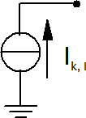

Элементы источников тока
================================

Источники энергии с преобразовательными элементами, такие как солнечные или ветряные электростанции, моделируются как источники тока:

Предполагается, что все элементы статического генератора являются элементами преобразователя, за исключением случаев, когда тип указан как «двигатель». В этом случае они рассматриваются как асинхронные машины.
    
Индуктивный ток короткого замыкания рассчитывается по параметрам элементов "Генератор ВИЭ, КГУ" как:

.. math::
    \underline{I}_k = -j \cdot \frac{k \cdot s\_n\_kva}{\sqrt{3} \cdot vn\_kv}

где :math:`s\_n\_kva` - номинальная мощность генератора, :math:`k` - отношение номинального тока к току короткого замыкания. :math:`vn\_kv` - номинальное напряжение шины, к которой подключен генератор.