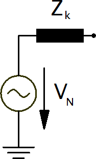
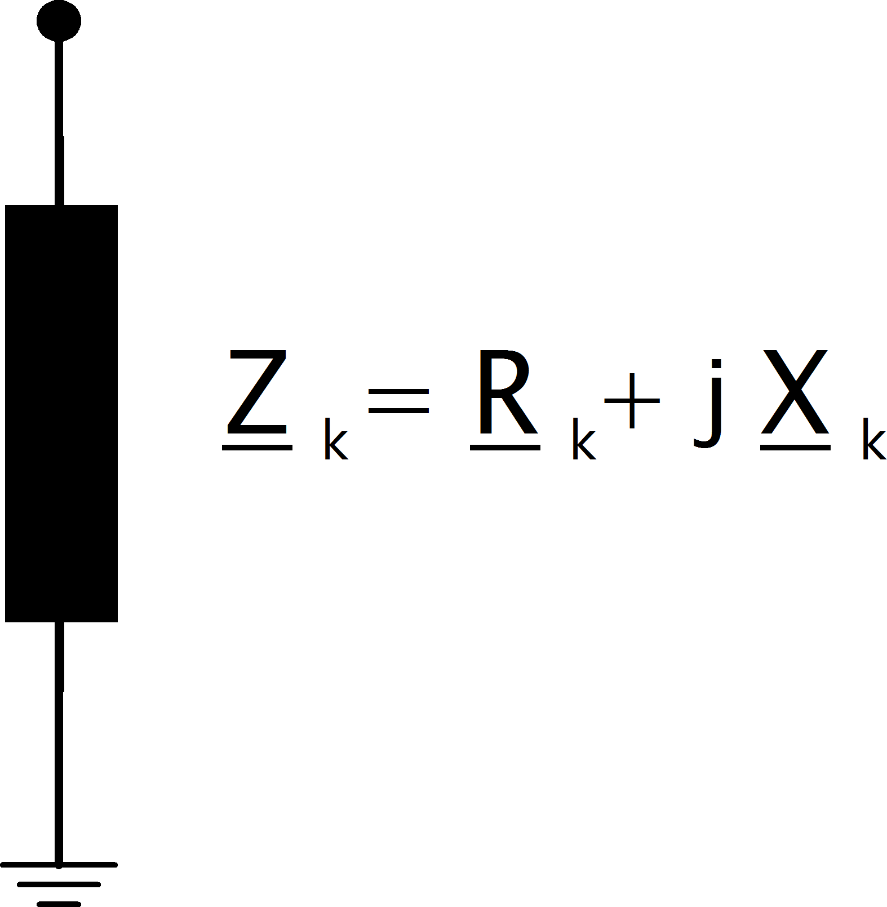

Элементы источников напряжения
================================

Источники напряжения представлены своим внутренним источником ЭДС и внутренним сопротивлением :math:`Z_k`:

    
поскольку источник напряжения перемещается к месту повреждения, используя методологию эквивалентного источника напряжения,
элемент источника напряжения может быть представлен единственным шунтирующим сопротивлением:
 

Вкладом нагрузок и шунтов можно пренебречь согласно стандарту. Поэтому им пренебрегают при расчете короткого замыкания.
    
Внешняя сеть
-----------------

При расчете максимальных токов короткого замыкания полное сопротивление внешней сети определяется как:

.. math::

  z_{k, eg} =& \frac{c_{max}}{s\_sc\_max\_mva} \\[1em]
  x_{k, eg} =& \frac{z_{sg}}{\sqrt{1 + rx\_max^2}} \\[1em]
  r_{k, eg} =& rx\_max \cdot x_{sg} 
  
где :math:`rx\_max` и :math:`s\_sc\_max\_mva` параметры внешней сети а :math:`c_{max}` - :ref:`коэффициент коррекции напряжения <c>`
для шины, к которой подключена внешняя сеть.

В случае минимальных токов короткого замыкания полное сопротивление рассчитывается соответственно:

.. math::

  z_{k, eg} =& \frac{c_{min}}{s\_sc\_min\_mva} \\[1em]
  x_{k, eg} =& \frac{z_{sg}}{\sqrt{1 + rx\_min^2}} \\[1em]
  r_{k, eg} =& rx\_min \cdot x_{sg} 

Асинхронный двигатель
-----------------------
Асинхронные двигатели можно моделировать указав для элемента "Генератор ВИЭ, КГУ" параметр «двигатель». Затем внутреннее сопротивление рассчитывается как:

.. math::

    Z_{k, m} = \frac{1}{k} \cdot \frac{vn\_kv^2 \cdot 1000}{sn\_kva} \\
    X_{k, m} = \frac{Z_{sg}}{\sqrt{1 + rx^2}} \\
    R_{k, m} = rx \cdot X_{sg}

где :math:`sn\_kva` номинальная мощность двигателя, :math:`k` отношение номинального тока к току короткого замыкания а :math:`rx` это отношение R/X двигателя.
:math:`vn\_kv` номинальное напряжение шины, к которой подключен двигатель..

    
Синхронный генератор
-----------------------
Рассматриваются синхронные генераторы с полным сопротивлением короткого замыкания:

.. math::
    \underline{Z}_{k, gen} = K_G \cdot (R''_d + jX''_d)

Сопротивление короткого замыкания рассчитывается как:

.. math::

    z_k = xdss  
    
Коэффициент коррекции генератора :math:`K_G` определяется как:

.. math::

    K_G = \frac{V_{N, gen}}{V_{N, bus}} \cdot \frac{c_{max}}{1 + x_{dss} \cdot sin(\varphi)}
    
где :math:`V_{N, bus}` - номинальное напряжение шины, к которой подключен генератор, :math:`V_{N, gen}` - номинальное напряжение генератора,
которое определяется параметром :math:`\text{sn\_kva}` синхронного генератора. Номинальный угол вектора :math:`\varphi` определяется как:

.. math::

    \varphi = arcos(cos\_phi)
    
где :math:`cos\_phi` определён в параметрах синхронного генератора.